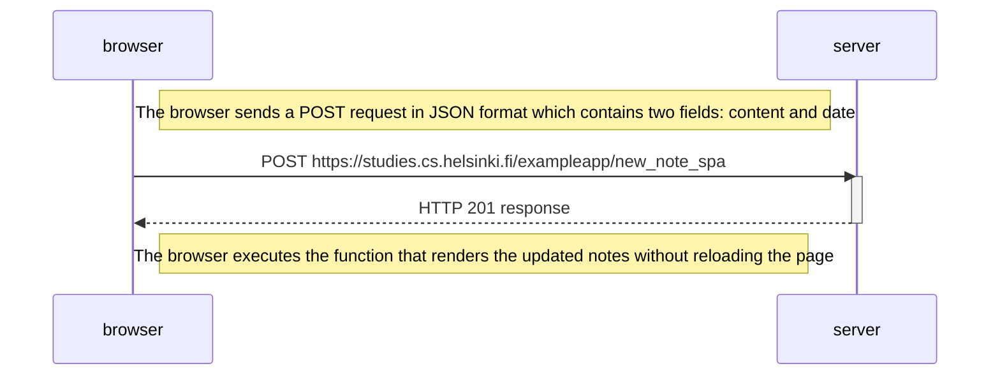

```mermaid
sequenceDiagram
    participant browser
    participant server

    Note right of browser: The browser sends a POST request in JSON format which contains two fields: content and date

    browser->>server: POST https://studies.cs.helsinki.fi/exampleapp/new_note_spa
    activate server
    server-->>browser: HTTP 201 response
    deactivate server

    Note right of browser: The browser executes the function that renders the updated notes without reloading the page


```